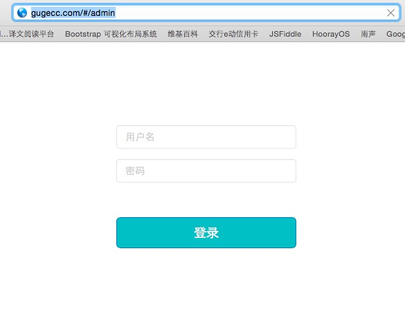
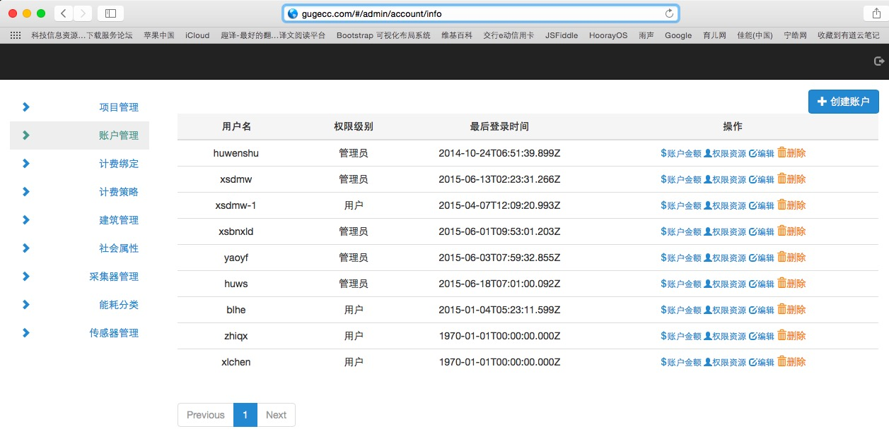
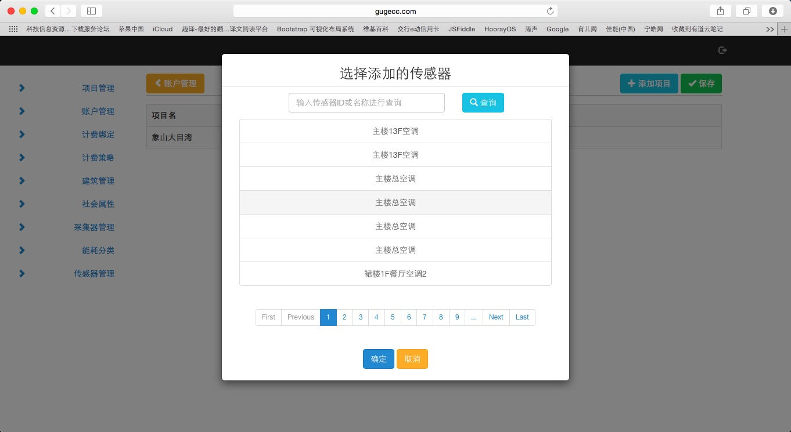
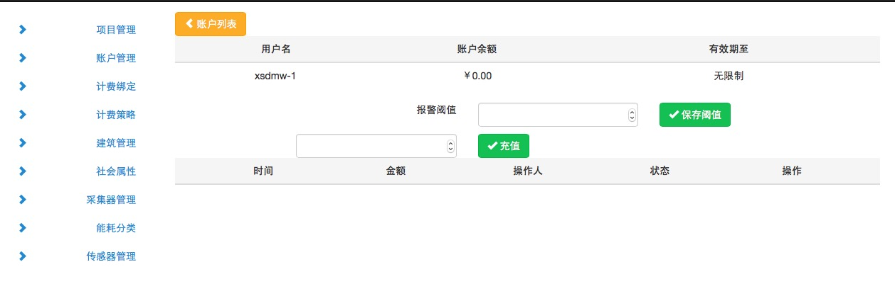

#古鸽智慧能源预付费使用简单说明

##管理后台设置

对商户启用预付费，需要先期在后台对每个商户开一个帐户，并且设置每个帐户的报警阀值。

在浏览器里输入 http://gugecc.com/#/admin

  

输入管理员用户名，密码后，点登录，进入后台管理界面，点开帐户管理

 然后对每一个商户，开一个用户帐户，并且把从属于这个商户的电表指定给这帐户
 

指定好每个商户的电表后，再设置每个商户透支额度，或者低于多少金额报警

同时在这个页面，可以对直接交现金的商户，物业手工充值。使用充值功能。

当后台对给每个商户开通帐号以后。

商户关注“能源管家” 微信公众号，使用后台分配的帐号绑定后，可直接使用

<iframe src="http://modao.io/app/qfayiGkPFP2o91aYaG2t/embed" width="426" height="841" allowTransparency="true" frameborder="0"></iframe>

客户端，进行充值，查看帐户及用电详情。